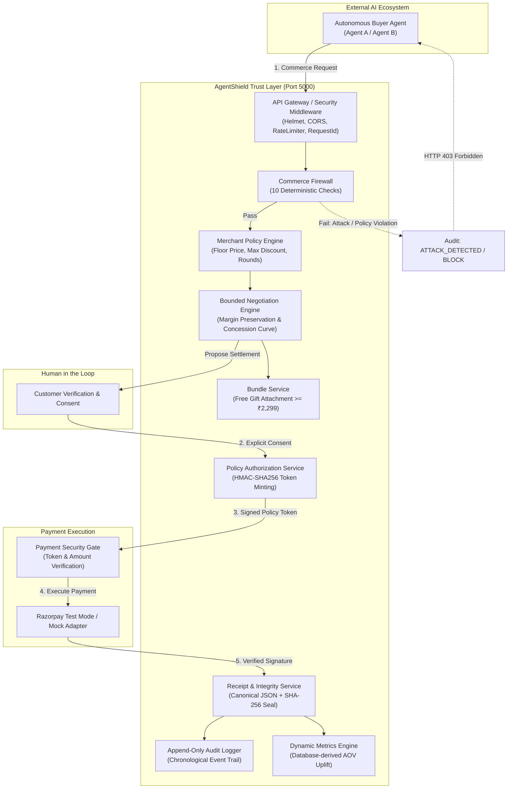

# AgentShield Architecture & System Design

## 1. Executive Summary

**AgentShield** is the trust and safety layer for AI-driven agentic commerce. It solves a fundamental vulnerability in autonomous commerce: **if an AI agent can directly execute payments or dictate prices, attackers can exploit prompt injections to buy merchandise for ₹1.**

AgentShield enforces the strict invariant:
> *"AI proposes. Policy authorizes. Customer consents. Razorpay executes. The receipt proves why."*

---

## 2. High-Level Architecture Diagram



---

## 3. Core Architectural Principles

1. **Deterministic Enforcement over Probabilistic AI**: AI agents are never given authority over money or price setting. Merchant policy is executed deterministically in server-side code.
2. **Zero Direct Payment Invocations**: Payment endpoints reject any direct request that lacks a cryptographically signed `Policy Authorization Token` binding the exact session, agent, product, and price.
3. **Defense in Depth**: Even if a sophisticated adversarial prompt bypasses regex injection detection, the deterministic **Price Boundary** check (`proposedPrice >= floorPrice`) strictly blocks any under-floor settlement.
4. **Tamper-Evident Receipts**: Every completed settlement generates a deterministic canonical JSON payload hashed with SHA-256, allowing merchants and auditors to verify post-settlement integrity.
5. **Zero-Hallucination Explainability**: All decisions (`APPROVE`, `COUNTER`, `SETTLE`, `BLOCK`) generate human-readable explanations derived exclusively from structured policy facts.

---

## 4. Component Directory Structure

```text
backend/src/
├── app.js                          # Express application entry & middleware pipeline
├── server.js                       # HTTP server listener
├── config/
│   ├── env.js                      # Environment configuration
│   ├── database.js                 # Unified in-memory / Mongoose compatible store
│   ├── catalog.js                  # Sports catalog seed (5 INR products)
│   └── constants.js                # Decision enums & injection regex signatures
├── models/
│   ├── Product.js                  # Product entity model
│   ├── MerchantPolicy.js           # Merchant policy envelope model
│   ├── Agent.js                    # Registered AI agent model
│   ├── NegotiationSession.js       # Multi-round session state model
│   ├── Transaction.js              # Payment order & transaction model
│   ├── NegotiationReceipt.js       # Sealed negotiation receipt model
│   └── AuditEvent.js               # Immutable audit event model
├── routes/
│   ├── health.routes.js            # GET /api/health
│   ├── catalog.routes.js           # GET /api/catalog, GET /api/catalog/ai
│   ├── product.routes.js           # GET /api/products, GET /api/products/:id
│   ├── policy.routes.js            # GET /api/policies, PUT /api/policies/:id
│   ├── agent.routes.js             # GET /api/agents, POST /api/agents
│   ├── firewall.routes.js          # POST /api/firewall/evaluate
│   ├── negotiation.routes.js       # POST /api/negotiations, /offer, /accept
│   ├── payment.routes.js           # POST /api/payments/create, /verify
│   ├── receipt.routes.js           # GET /api/receipts, POST /:id/verify
│   ├── audit.routes.js             # GET /api/audit
│   ├── metrics.routes.js           # GET /api/metrics
│   └── demo.routes.js              # POST /api/demo/legitimate, /adversarial
├── services/
│   ├── firewall.service.js         # 10 deterministic firewall checks
│   ├── injectionDetector.service.js# Regex-based prompt injection detection
│   ├── policy.service.js           # Merchant policy retrieval & updates
│   ├── negotiation.service.js      # Margin-preserving concession engine
│   ├── bundle.service.js           # Bundle threshold evaluation
│   ├── authorization.service.js    # HMAC-SHA256 policy token issuer & validator
│   ├── payment.service.js          # Gated payment router
│   ├── razorpay.service.js         # Razorpay Test Mode adapter
│   ├── mockPayment.service.js      # Zero-config deterministic mock payment adapter
│   ├── receipt.service.js          # Canonical JSON + SHA-256 seal & verification
│   ├── audit.service.js            # Chronological append-only logger
│   ├── metrics.service.js          # Database-derived AOV & uplift analytics
│   └── explainability.service.js   # Zero-hallucination fact synthesizer
└── utils/
    ├── canonicalJson.js            # Deterministic JSON serialization
    ├── crypto.js                   # HMAC & SHA-256 cryptographic utilities
    ├── logger.js                   # Structured logging utility
    └── errors.js                   # Domain error classes & HTTP mappings
```
