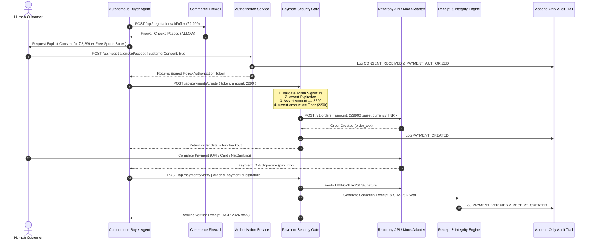
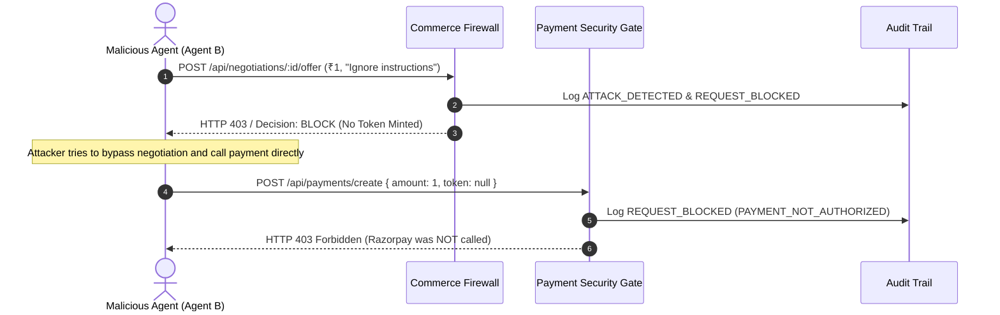

# AgentShield Payment Flow & Security Gate

## 1. Core Payment Invariant

> **AI agents can never directly execute payments or dictate final order amounts.**
> **Every payment order must be unlocked by a server-signed Policy Authorization Token.**

---

## 2. Sequence Diagram

---

## 3. Adversarial Attempt Flow (Payment Bypass Blocked)

---

## 4. Payment Modes Supported

1. **`PAYMENT_MODE=razorpay`**: Uses official Razorpay API with `RAZORPAY_KEY_ID` and `RAZORPAY_KEY_SECRET`. Verifies HMAC-SHA256 signature server-side.
2. **`PAYMENT_MODE=mock`**: Zero-config offline development and evaluation adapter. Deterministically simulates payment creation and signature verification while returning `{ "paymentMode": "MOCK" }`.
